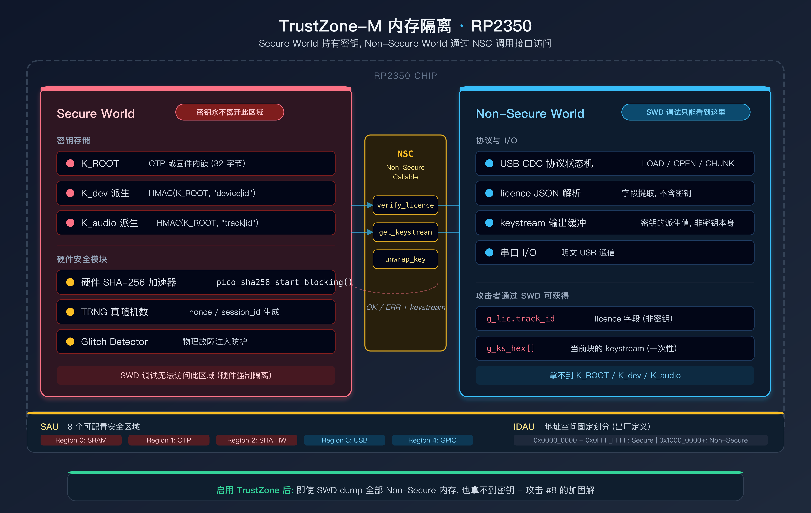
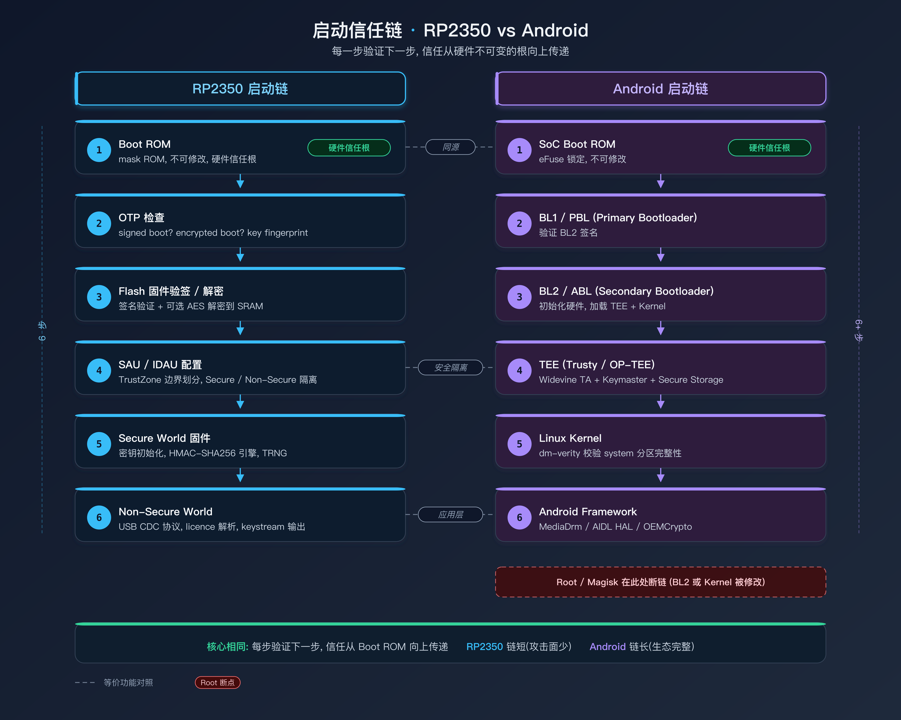
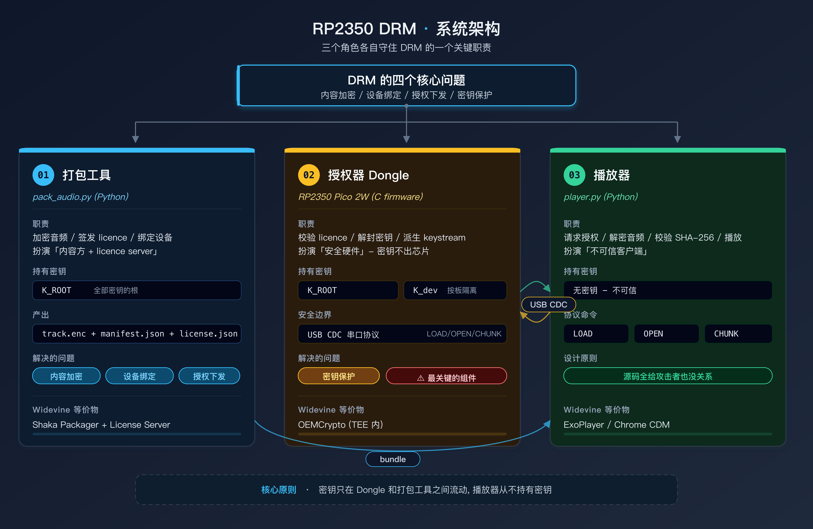
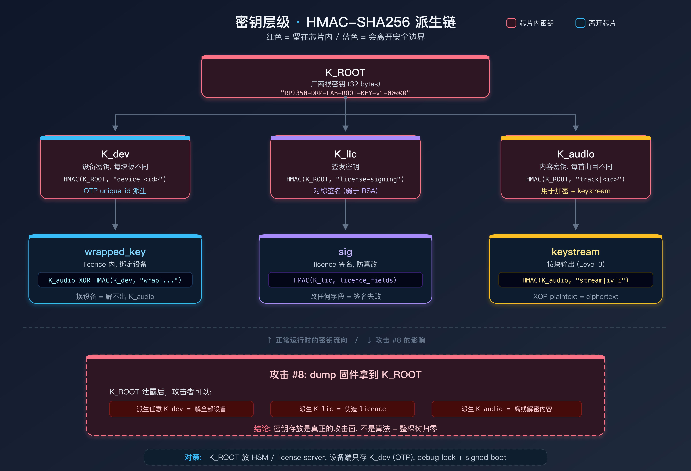
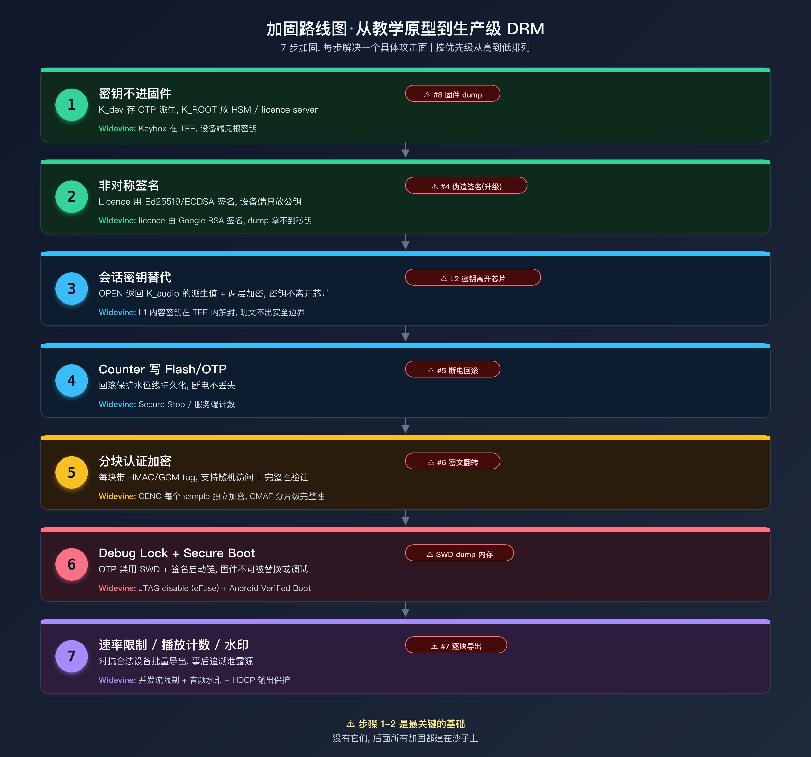

> **读完本文，你将获得：**
> - 理解 DRM 系统的四个核心问题：内容加密、设备绑定、授权下发、密钥保护
> - 看到一个完整的、可运行的硬件 DRM 原型：从内容打包到设备授权到加密播放
> - 理解基于 HMAC-SHA256 的密钥层级设计，以及为什么每个公式是这样的
> - 对照 Widevine L1/L2/L3，理解「密钥是否离开芯片」这件事的实际含义
> - 亲手对自己造的 DRM 运行 8 条攻击，看到每一条防御挡住了什么、挡不住什么
> - 获得一张从教学原型到商业级 DRM 的加固路线图，以及与 Widevine/PlayReady 的差距对比

**阅读路线：**

| 目标 | 推荐章节 | 可以先跳过 |
|------|----------|------------|
| 建立 DRM 全局直觉 | 一～三 | 具体命令和代码 |
| 复现实验 | 四～五 | 加固路线和商业对比 |
| 做安全评估 | 六～八 | 密码学公式细节 |
| 评估与商业 DRM 差距 | 八～九 | 复现步骤 |

> **研究边界**：本文的所有实验仅针对**自有音频内容**和**自有硬件设备**。不涉及任何商业 DRM 系统的绕过或密钥提取。代码中的根密钥是故意写死的教学值 —— **不要拿这套代码保护任何真实内容**。

### 实验环境

| 项目 | 规格 |
|------|------|
| **板子** | Raspberry Pi Pico 2W（RP2350A，Cortex-M33 双核 @150MHz，520KB SRAM，4MB Flash） |
| **上位机** | MacBook Pro M1，macOS Sonoma |
| **SDK** | pico-sdk 2.1.0 + pico-extras（cyw43 WiFi/BLE） |
| **工具链** | arm-none-eabi-gcc 13.2.1 |
| **Python** | 3.12 + pyserial（串口通信） |
| **调试** | picotool 2.1.0（烧录 / info / reboot） |

### 源码文件

```
labs/14_drm_dongle/
├── CMakeLists.txt
└── src/
    ├── main.c            固件：USB CDC 协议状态机 + licence 校验 + 会话管理 + 分块 keystream
    └── drm_crypto.c/h    HMAC-SHA256（手写 ipad/opad，SHA-256 走 RP2350 硬件加速器）

tools/drm/
├── drm_common.py         协议与密码学的"唯一真相"（与固件逐字对齐）
├── pack_audio.py         内容方：加密 WAV + 生成 manifest + 签发 licence
├── dongle_sim.py         虚拟 dongle（纯 Python，不需要板子也能跑全流程）
├── player.py             播放器：向 dongle 要密钥 → 解密 → 校验 → 播放
├── attack.py             8 条攻击的自动化实验台
└── parity_check.py       固件与上位机协议一致性自检
```

---

## 一、为什么要自己造一个 DRM

Widevine、PlayReady、FairPlay —— 商业 DRM 系统的架构文档可以读上万页，但它们的代码是闭源的，协议是加密的，密钥管理深藏在 TEE 和安全芯片里。站在外面看，你能看到协议握手的流程图；站在里面看，你还是不知道一条 licence 被篡改时到底哪一步会拒绝它、拒绝的原因是什么。

**理解攻击面的最好方式不是读文档，是自己造一个。**

协议自己写，密码学自己选，固件自己编译，然后自己攻击它 —— 每一条防御挡住了什么，没挡住什么，清清楚楚。

### 为什么用 RP2350

RP2350 是 Raspberry Pi 的第二代微控制器（Pico 2 上面那颗芯片），5 美元一块，但它带了几个对 DRM 实验很有用的特性：

| 特性 | DRM 实验中的作用 |
|------|-----------------|
| **硬件 SHA-256 加速器** | 密钥派生和 keystream 生成不占 CPU，性能有保障 |
| **OTP（一次性可编程存储）** | 可以把设备密钥烧进去，软件 dump 不出来 |
| **TrustZone-M** | Cortex-M33 的安全世界/非安全世界隔离 |
| **双架构（ARM / RISC-V）** | 同一份协议可以编译成两种 ISA，做跨架构逆向对比 |
| **SWD 调试口** | 攻击实验时可以用它 dump 内存、注入数据 |
| **USB CDC** | 板子直接作为 USB 串口设备，不需要额外硬件 |

关键点：这些特性在**实验阶段**可以选择性开关。先开着 debug 口方便做攻击实验，做完再 lock 掉做加固对比 —— 同一块板子走完攻防两面。

### RP2350 的 TrustZone-M：$5 能买到的 TEE

上面表格里提了一句「TrustZone-M」，但这个概念值得展开，因为它直接关系到 DRM 密钥保护的核心问题。

手机 SoC 上的 TrustZone（Cortex-A 系列）大家可能更熟悉 —— Widevine L1 的 keybox 就存在 TEE 里，由 Trusty 或 OP-TEE 管理，普通 Android 应用根本看不到那片内存。RP2350 上的 TrustZone-M 是同一个思想在 MCU 上的简化实现：把芯片的资源（内存、外设、GPIO、DMA）分成 **Secure World** 和 **Non-Secure World**，两个世界之间有硬件强制的隔离边界。

具体到 RP2350，隔离由两层机制实现：

- **IDAU（Implementation Defined Attribution Unit）**：芯片出厂时就定义好的安全属性，把地址空间划成固定的安全/非安全区域
- **SAU（Security Attribution Unit）**：软件可配置的覆盖层，最多 8 个区域，可以把 IDAU 标记为安全的区域「降级」为非安全

两层叠加的效果是：Secure World 的代码可以访问所有资源，Non-Secure World 的代码只能访问被标记为非安全的那部分。跨边界调用必须通过 `NSC（Non-Secure Callable）` 入口点 —— 相当于一个硬件强制的 syscall 接口。

这对 DRM 意味着什么？如果我把密钥派生逻辑（`K_dev`、`K_audio` 的 HMAC 计算）放在 Secure World 运行，把协议状态机和 USB CDC 通信放在 Non-Secure World，那么即使攻击者通过 SWD 调试口 dump 了 Non-Secure 侧的全部内存，也拿不到密钥 —— 密钥从来没有出现在 Non-Secure 的地址空间里。



不过，和 Cortex-A 上的完整 TEE 相比，TrustZone-M 有几个明显的差距：

| | TrustZone-M (RP2350) | TEE (Trusty / OP-TEE) |
|---|---|---|
| 处理器 | Cortex-M33 (MCU) | Cortex-A (应用处理器) |
| 操作系统 | 裸机或轻量 RTOS | 完整的 Trusted OS |
| 安全应用 | 一个 Secure 固件 | 多个 Trusted Application (TA) |
| 内存保护 | SAU + IDAU（区域级） | MMU + TZASC（页级） |
| 密钥存储 | OTP + SRAM（无加密文件系统） | Secure Storage（加密 + 防回滚） |
| 安全启动 | Signed/encrypted boot（OTP 存 fingerprint） | 完整信任链（bootloader → TEE → Android） |
| 物理防护 | Glitch detector + brownout detector | 取决于 SoC 厂商 |
| 调试锁定 | SWD disable（OTP 不可逆） | JTAG disable（eFuse） |

关键区别不在隔离能力本身 —— TrustZone-M 的隔离是硬件强制的，和 Cortex-A 一样可靠 —— 而在 **生态支持**。手机上的 TEE 有完整的 Trusted OS、安全存储、密钥管理 API、Attestation 证书链；RP2350 上你得自己写所有东西。但换个角度看，这正是它做实验的价值：你能看到 TEE 底层每一个机制是怎么组装起来的。

> **本实验暂时没有启用 TrustZone**。原因很简单：如果密钥被隔离保护了，攻击 #8（dump 固件拿 K_ROOT）就跑不了了，而那条攻击恰恰是最有教学价值的。加固路线图第 6 步（debug lock + secure boot）会在后续实验中启用 TrustZone，届时再来对比攻击面的变化。
>
> 有一个额外的细节：RP2350 在启用安全配置时会**禁用 RISC-V 核**（官方安全白皮书明确说明），以防止通过切换到 Hazard3 绕过 ARM 的安全模型。这意味着「双架构」和「安全模式」在当前的 RP2350 上是互斥的。

### 启动信任链：RP2350 vs Android

TrustZone 只解决运行时的隔离问题。但如果启动阶段有人篡改了固件，在安全世界里跑的就不再是你写的代码 —— 这时 TrustZone 隔离得再好也没用。所以 DRM 的安全边界不只是「有没有 TrustZone」，而是**从上电到密钥可用的整条启动链是否每一步都被验证过**。

这就是为什么需要理解启动流程。下面把 RP2350 和 Android 的启动链放在一起对比 —— 你会发现它们解决的是完全相同的问题，只是复杂度不同。



两条链的核心逻辑完全一样：**每一步都验证下一步的完整性，信任从硬件不可变的根（Boot ROM + OTP/eFuse）向上传递**。区别在于 Android 的链更长（多了 bootloader、Linux、framework 好几层），RP2350 的链极短（Boot ROM 直接到用户固件）—— 层数少意味着攻击面也少，这是 MCU 安全模型的天然优势。

### Root 和 DRM 的关系

理解了启动链之后，「root = DRM 失效」这件事就不再是一句口号，而是有具体的因果关系：

**Android root 破坏了什么？**

root 本质上是在启动链的某个环节插入了未授权的代码（修改 boot.img、安装 Magisk 等），打破了 Verified Boot 的验证链。一旦链断了：

1. **内核被修改** → 攻击者可以 hook 系统调用，监控 HAL 层的通信
2. **SELinux 被关闭/降级** → 原本隔离的安全域边界松动
3. **可以访问 /dev/ion 或 secure memory 的映射** → 有机会读到本应隔离的内存区域
4. **Magisk 可以 hook framework 层** → 拦截 MediaDrm API 调用，截获 license response

但 root **不能直接**破解 TEE。TrustZone 的隔离是硬件级别的，root 拿到的是 Normal World 的 kernel 权限，不是 Secure World 的权限。所以 Widevine L1 在 root 设备上通常会**降级到 L3**（Google 的 SafetyNet / Play Integrity 检测到 root → 拒绝发放 L1 license），而不是直接被破解。

**RP2350 上的类比**：

本实验中「root」的等价操作是通过 SWD 调试口连上去（相当于拿到了 Non-Secure World 的全部权限）。SWD 能 dump Non-Secure 侧的内存、修改变量、注入指令 —— 这对应 Android root 能做的事情。如果启用了 TrustZone，SWD 仍然无法读取 Secure World 的内存（硬件禁止）；但如果进一步做了 debug lock（OTP 禁用 SWD），连 Non-Secure 侧也进不去了 —— 这对应 Android 手机的 JTAG 被 eFuse 烧断。

```
Android root                    RP2350 SWD 调试
────────────────────           ──────────────────
修改 boot.img                   → 替换 Flash 上的固件
hook framework (Magisk)         → 修改 Non-Secure 代码运行时行为
读 /proc/pid/mem                → SWD 读 SRAM
无法直接进 TEE                   → 无法读 Secure World (TrustZone-M)
SafetyNet 检测 → L1 降级 L3     → boot ROM 验签失败 → 拒绝启动
```

> **关键区别**：Android root 之后 TEE 还在，只是 license server 不信任你了（策略降级）。RP2350 上如果 debug lock + signed boot 都没开，SWD 可以直接改固件 —— 连降级机会都没有，直接全盘沦陷。这就是攻击 #8 展示的事情。

---

## 二、整体架构

确定了「自己造一个」的思路之后，下一步是决定系统长什么样。我想让它尽可能接近商业 DRM 的核心逻辑，但去掉所有不影响安全性理解的复杂度 —— 比如不做 DRM 证书链、不做 CDN 分发、不做多租户。最终的系统只有三个角色：

```
   ┌────────────┐  ① LOAD licence   ┌─────────────────────┐
   │  播放器     │ ────────────────▶ │  Pico 2W  (dongle)  │
   │  player.py │  ② OPEN nonce     │  K_ROOT / K_dev     │
   │            │ ◀──────────────── │  K_audio 永不出芯片  │
   │            │  ③ key 或 keystream└─────────────────────┘
   │ HMAC-CTR   │
   │ 解密+播放   │  ④ 解密 → 校验 SHA-256 → 播放
   └────────────┘
```

| 角色 | 实现 | 职责 |
|------|------|------|
| **打包工具** `pack_audio.py` | Python（Mac 或 Pi 上运行） | 加密音频、生成 manifest、签发 licence |
| **授权器** dongle 固件 | C（RP2350 Pico 2W） | 保存设备密钥、校验 licence、派生会话密钥、按块返回 keystream |
| **播放器** `player.py` | Python（Mac 或 Pi 上运行） | 读取加密音频、向 dongle 请求授权、解密、播放 |

此外有一个 **虚拟 dongle** `dongle_sim.py`，用纯 Python 模拟 RP2350 的行为。没有硬件也能把整套流程跑通。

### 各模块到底做什么

三个角色各自守住 DRM 的一个关键职责，逐个拆开讲。

**打包工具 `pack_audio.py`** 扮演的是「内容方 + licence server」。它手里有 K_ROOT，所以能做三件事：(1) 派生 K_audio 加密音频；(2) 派生 K_dev，把 K_audio 包裹成只对目标设备有意义的 wrapped_key；(3) 派生 K_lic 给整条 licence 签名。这三步对应 DRM 的前三个问题 —— 内容加密、设备绑定、授权下发。

**授权器 dongle 固件 `main.c`** 扮演的是「安全硬件」。它是唯一在运行时持有密钥的组件。收到 licence 后，它用自己的 K_dev 解开 wrapped_key 得到 K_audio，然后根据 allow_key 字段决定：Level 2 直接返回 K_audio，Level 3 只按块返回 keystream。这一步对应第四个问题 —— 密钥保护。

**播放器 `player.py`** 扮演的是「不可信客户端」。它不知道任何密钥 —— 只能向 dongle 请求授权，拿到密钥或 keystream 后解密。你可以把源码全部给攻击者，它也不包含秘密。这和 Netflix APK 的设计一样：反编译随便看，密钥在 TEE 里。

#### 和 Widevine L1 的角色对照

理解了这三个模块之后，可以直接映射到 Widevine L1 的架构上 —— 名字不同，但每个组件解决的问题完全一样：

| 本实验 | Widevine L1 | 共同职责 |
|--------|------------|---------|
| `pack_audio.py` | **Shaka Packager + Widevine License Server** | 加密内容、签发 licence、绑定设备 |
| `drm_common.py` | **Widevine License Protocol (protobuf)** | 协议和密码学的规范定义 |
| dongle 固件 (`main.c`) | **OEMCrypto (TEE 内)** | 持有设备密钥、校验 licence、解封内容密钥、不让密钥出安全边界 |
| `player.py` | **ExoPlayer / Chrome CDM 宿主** | 不可信客户端，只负责转发授权请求和播放解密后的内容 |
| `dongle_sim.py` | **Widevine L3 CDM (软件 CDM)** | 软件模拟，没有硬件保护，密钥在主机内存里 |
| USB CDC 串口协议 | **AIDL HAL / Mojo IPC** | 安全边界两侧的通信通道 |
| `parity_check.py` | **Widevine VTS (Vendor Test Suite)** | 验证安全侧和客户端侧的协议实现一致 |

核心区别在于 Widevine L1 的 OEMCrypto 跑在 ARM TrustZone 的 Secure World 里，由 Trusty/OP-TEE 管理，密钥存储由 SoC 厂商的 Secure Storage 提供；而本实验的 dongle 是一整块独立的芯片，安全边界是 USB 线 —— 更粗糙，但原理完全一致。

另一个重要区别：Widevine 的 licence 是 protobuf 格式，由 Google 签名（RSA），经过 License Proxy（合作方的业务鉴权中间层）下发；本实验的 licence 是 JSON 格式，HMAC 对称签名，直接打包在文件里。对称签名的问题在于：拿到 K_lic 就能伪造 licence（见攻击 #4 + #8）。Widevine 用非对称签名避免了这个问题 —— 即使设备端被 dump，拿到的只是公钥，伪造不了签名。

### 协议时序

下面这张架构图展示三个角色的职责分工、数据流向，以及和 Widevine L1 各组件的对应关系：



### 密钥层级图

下面这张图是整个系统的密钥流向。红色节点是「留在芯片里」的密钥，蓝色是「会离开芯片」的数据。攻击者的目标是沿着红色节点往上走 —— 够到 K_ROOT 就能通杀一切。



### 威胁模型

实验假设攻击者能做到以下事情：

| 攻击者能力 | 是否防御 |
|-----------|---------|
| 拿到加密音频文件 | 有：内容加密 |
| 拿到播放器源码或二进制 | 有：密钥不在播放器里 |
| 复制 licence 文件 | 有：licence 绑定设备 |
| 抓 USB 串口通信 | 有：nonce 防重放 |
| 重放旧授权请求 | 有：会话 nonce + 缓存 |
| 分析 RP2350 固件（strings/Ghidra） | **部分**：根密钥在固件里（故意的，见攻击 #8） |
| 高成本物理攻击（芯片开盖） | 不防 |
| 模拟音频输出录制 | 不防 |

---

## 三、密码学设计：全 SHA-256 族

架构画完了，接下来最重要的决定是选什么密码学原语。我最初想用 AES —— 毕竟 Widevine 和 PlayReady 都是 AES-128-CTR（CENC 标准）。但 RP2350 没有硬件 AES 加速器，软件 AES 在 Cortex-M33 上虽然能跑，但密钥派生、流加密、签名验证加起来会吃掉不少 CPU。

然后我注意到 RP2350 自带**硬件 SHA-256 加速器**。如果把所有密码学操作都建在 HMAC-SHA256 上，核心的压缩函数走硬件，性能就不再是瓶颈。

所以最终的选择是：整个系统只用到一个原语 —— **HMAC-SHA256**。没有 AES，没有 RSA，没有椭圆曲线。HMAC 的 ipad/opad 结构用软件做（`drm_crypto.c` 里手写，对照 RFC 2104），核心的 SHA-256 压缩走硬件加速器 —— 密钥派生和 keystream 生成几乎不占 CPU 时间。

### 密钥层级

```
K_ROOT（厂商根密钥，32 字节，教学版明文写在固件里）
├── K_dev  = HMAC(K_ROOT, "device|<device_id>")        设备密钥，每块板不同
├── K_lic  = HMAC(K_ROOT, "license-signing")            licence 签发密钥
└── K_audio = HMAC(K_ROOT, "track|<track_id>")          内容密钥，每首曲目不同
```

### 为什么这么设计

**K_dev 绑设备**：`device_id` 来自 RP2350 的 OTP 唯一 ID（`pico_get_unique_board_id()`）。同一份固件烧到两块板子，会得到两把不同的 `K_dev`。licence 里的 `wrapped_key` 是用 `K_dev` 包裹的，所以 licence 不能在设备之间互换。

**K_audio 绑内容**：每首曲目有独立的内容密钥。一首曲目被破解不影响其他曲目。

**K_lic 签名 licence**：licence 的所有授权字段（device_id、track_id、版本号、wrapped_key）都被 HMAC 签名覆盖，篡改任何字段都会导致签名校验失败。

### 完整公式表

| 用途 | 公式 |
|------|------|
| 设备密钥 | `K_dev = HMAC(K_ROOT, "device\|<device_id>")` |
| 签发密钥 | `K_lic = HMAC(K_ROOT, "license-signing")` |
| 内容密钥 | `K_audio = HMAC(K_ROOT, "track\|<track_id>")` |
| 密钥包裹 | `wrapped_key = K_audio XOR HMAC(K_dev, "wrap\|<device>\|<track>")` |
| licence 签名 | `sig = HMAC(K_lic, "license\|v=…\|device_id=…\|…\|wrapped_key=…")` |
| 流加密 | `keystream_block(i) = HMAC(K_audio, "stream\|<iv>\|<i:016x>")` |
| 会话确认 | `resp = HMAC(K_audio, "open\|<device>\|<track>\|<nonces>\|<session>")` |

### HMAC-CTR 流加密

密文 = 明文 XOR keystream。每块 keystream 是一次 HMAC 调用，块索引递增，等价于 CTR 模式。

> 这是教学用的流加密。生产环境请换 AES-GCM 或 ChaCha20-Poly1305，把完整性校验做进密文格式。本实验的完整性靠 manifest 里的 SHA-256 哈希事后校验。

用图来看会更直观 —— 每一块的 keystream 都是一次独立的 HMAC 调用，块与块之间没有依赖，理论上可以并行。密文 = 明文 XOR keystream，解密反过来即可：

```
Block 0:  K_audio + iv + "0000000000000000" → HMAC-SHA256 → keystream₀ ⊕ plaintext₀ → ciphertext₀
Block 1:  K_audio + iv + "0000000000000001" → HMAC-SHA256 → keystream₁ ⊕ plaintext₁ → ciphertext₁
  ...
Block N:  K_audio + iv + "000000000000007f" → HMAC-SHA256 → keystream_N ⊕ plaintext_N → ciphertext_N
```

固件里的实现（`drm_crypto.c`）值得单独说一句：HMAC 的 ipad/opad 结构是手写的，对照 RFC 2104 逐步实现，内层和外层的 SHA-256 压缩都走 `pico_sha256_start_blocking` 硬件加速器。比较操作用 `drm_const_time_eq`（常量时间比较），防止通过时序差异推断签名。

---

## 四、Level 2 vs Level 3：密钥是否离开芯片

密码学设计完成后，我面临的下一个问题是：密钥到底应不应该离开 dongle？这是整个 DRM 最关键的分界线。本实验用同一套加密格式，通过 licence 里的一个字段 `allow_key` 控制：

| | Level 2 | Level 3 |
|---|---------|---------|
| `allow_key` | 1 | 0 |
| OPEN 响应 | 返回 `K_audio`（密钥） | 不返回密钥 |
| 解密方式 | 播放器拿到密钥，一次性解密 | 播放器按块请求 keystream |
| 密钥是否进入主机内存 | **是** | **否**（只有 keystream 进入） |
| 安全边界 | 密钥泄露 = 永久可解密 | 攻击者需要 dongle 在线才能解密 |

对照 Widevine 的安全级别（详见[《有了 PSSH 还是拿不到 Key》](/posts/widevine-pssh-license-l1-deep-dive/)）：

| Widevine | 密钥处理 | 解密位置 | 近似对应 |
|----------|---------|---------|---------|
| **L1** | 密钥在 TEE/SE 内 | 在安全硬件内解密 | 本实验没有等价物（需要 RP2350 自己解密音频输出） |
| **L2** | 密钥在 TEE 内 | CPU 处理解密后内容 | — |
| **L3** | 密钥在软件中 | 软件解密 | 本实验的 Level 2（密钥进主机内存） |

本实验的 Level 3（keystream-only）比 Widevine L3 更强一点：密钥本身不离开芯片，只有 keystream 流出去。但内容仍然可以被完整还原 —— 见攻击 #7。

---

## 五、跑通全流程

理论说得够多了，接下来是把整套系统跑起来。我会先用虚拟 dongle 跑通（不需要任何硬件），再接上真板子。

### 5.1 不需要硬件：虚拟 dongle

```sh
# 造 3 秒测试音频
tools/drm/pack_audio.py --make-demo out/demo.wav

# 打包（licence 绑定到虚拟设备）
tools/drm/pack_audio.py --wav out/demo.wav --device-id sim --out-dir out/bundle

# 播放（用 Python 虚拟 dongle）
tools/drm/player.py --bundle out/bundle --sim
```

三条命令走完打包 → 授权 → 解密 → 播放的全流程。虚拟 dongle 的密码学实现和固件逐字对齐（有一致性自检脚本 `parity_check.py` 保证）。

**打包输出：**

```
$ tools/drm/pack_audio.py --make-demo out/demo.wav
demo WAV  ->  out/demo.wav (3.0s, 22050Hz, mono, 16-bit)

$ tools/drm/pack_audio.py --wav out/demo.wav --device-id sim --out-dir out/bundle
WAV        : out/demo.wav (132300 字节 PCM)
track_id   : demo
device_id  : 0123456789abcdef
level      : Level 2 (allow_key=1, 密钥会离开芯片)
chunks     : 130 x 1024 字节
iv         : 8ffce6a87be891c3
自检       : OK
输出       : out/bundle/{track.enc,manifest.json,license.json}
```

打包工具生成了三个文件。`manifest.json` 描述加密参数，`license.json` 绑定到特定设备：

```json
// license.json — 注意 wrapped_key 是用本机 K_dev 包裹的，换一台设备解不开
{
  "v": 1,
  "device_id": "0123456789abcdef",
  "track_id": "demo",
  "iv": "8ffce6a87be891c3",
  "chunks": 130,
  "counter": 1,
  "allow_key": 1,
  "wrapped_key": "371f77cf2b0bba8f157d65dcbeefae179fcacaac47d8bec087698b7cb9be066e",
  "sig": "630fe060b46bf28d85f9e3f56785341c9254a272e26b8b02f19c71d54fe8d142"
}
```

**Level 2 播放输出（密钥离开芯片）：**

```
$ tools/drm/player.py --bundle out/bundle --sim
dongle : virtual dongle
track  : demo (132300 字节, 130 块)
level  : 2 (返回内容密钥)
[1] INFO  : device_id=0123456789abcdef fw=sim-0.1
[2] LOAD  : track=demo counter=1 chunks=130 allow_key=1
[3] OPEN  : session=1 server_nonce=1125a06a6469d596 key=返回
[4] 确认  : resp 校验通过 (dongle 和播放器派生出同一个 K_audio)
            key = 6f78ae06...c07c112a   <-- 密钥已经离开芯片
[5] 校验  : SHA-256 一致 8f11cf1810c1d132... ✔
[6] 输出  : out/bundle/decrypted.wav
```

注意第 [3] 步，dongle 把完整的 `key` 返回给了播放器 —— 这就是 Level 2 的代价。攻击者在这一步截获密钥，以后不需要 dongle 就能解密。

### 5.2 接真硬件

```sh
# 编译固件
scripts/build_lab14.sh

# 烧录
picotool load -f build/14_drm_dongle/rp2350_drm_dongle.uf2
picotool reboot -f

# 打包（--port 自动向 dongle 要 device_id，保证 licence 绑定正确）
tools/drm/pack_audio.py --wav out/demo.wav --port /dev/cu.usbmodem14101 --out-dir out/hw

# 播放
tools/drm/player.py --bundle out/hw --port /dev/cu.usbmodem14101 --play
```

烧录成功后串口会打印：

```
=== RP2350 DRM Dongle Lab (fw 0.1) ===
device_id : e66164XXXXXXXXXX
chunk_size: 1024 bytes
type HELP for commands
[READY]
```

### 5.3 Level 2 / Level 3 对比

```sh
# Level 2：密钥出芯片，上位机一次性解密
tools/drm/pack_audio.py --wav out/demo.wav --device-id sim --out-dir out/l2

# Level 3：密钥不出芯片，按块取 keystream
tools/drm/pack_audio.py --wav out/demo.wav --device-id sim --no-key --out-dir out/l3
tools/drm/player.py --bundle out/l3 --sim
```

两个 bundle 用的是同一套加密格式，可以直接对比「密钥是否离开芯片」这件事。

**Level 3 播放输出（密钥不离开芯片）：**

```
$ tools/drm/player.py --bundle out/bundle_l3 --sim
dongle : virtual dongle
track  : demo (132300 字节, 130 块)
level  : 3 (只返回 keystream)
[1] INFO  : device_id=0123456789abcdef fw=sim-0.1
[2] LOAD  : track=demo counter=1 chunks=130 allow_key=0
[3] OPEN  : session=1 server_nonce=8c244f4dace48c2f key=WITHHELD(拒绝导出)
[4] CHUNK : 0/129 解密 1024 字节 (keys 始终留在芯片里)
[4] CHUNK : 1/129 解密 1024 字节 (keys 始终留在芯片里)
[4] CHUNK : 2/129 解密 1024 字节 (keys 始终留在芯片里)
    CHUNK : 3/129
    ...
    CHUNK : 128/129
[4] CHUNK : 129/129 解密 204 字节 (keys 始终留在芯片里)
[5] 校验  : SHA-256 一致 8f11cf1810c1d132... ✔
[6] 输出  : out/bundle_l3/decrypted.wav
```

对比两个 session：Level 2 的第 [3] 步返回了完整密钥，Level 3 只返回 `WITHHELD`。Level 3 需要 130 次 CHUNK 请求才能解完，但密钥始终没离开 dongle。

### 5.4 固件自检

串口敲 `KAT`，板子会用 RFC 4231 / FIPS 180-4 的标准测试向量验证 HMAC-SHA256 和硬件 SHA-256 通路：

```
> KAT
OK kat=pass vectors=rfc4231-1,rfc4231-2,sha256-abc
```

### 5.5 协议一致性自检

固件是 C 写的，上位机是 Python 写的，两边的协议字符串拼接必须完全一致，否则签名对不上。`parity_check.py` 逐条比对两边的格式串和常量：

```
$ tools/drm/parity_check.py
== 1. 固件里的格式串 ==
  ✔ licence 签名串      license|v=%u|device_id=%s|track_id=%s|iv=%s|chunks=%u|counte...
  ✔ 设备密钥派生           device|%s
  ✔ 内容密钥派生           track|%s
  ✔ 密钥包裹上下文          wrap|%s|%s
  ✔ keystream 块上下文   stream|%s|%016llx
  ✔ 会话确认串            open|%s|%s|%s|%s|%u
== 2. 同一组输入下的字符串比对 ==
  ✔ licence 签名串       ✔ 设备密钥派生       ✔ 内容密钥派生
  ✔ 密钥包裹上下文        ✔ keystream 块上下文  ✔ 会话确认串
== 3. 固件常量与上位机常量 ==
  ✔ K_ROOT (32 字节 ASCII)  ✔ CHUNK_SIZE 一致  ✔ HMAC ipad/opad

固件与上位机的协议拼接完全一致 ✔
```

这一步看起来无聊，但它救过我的命 —— 早期版本里固件用 `%016llx` 格式化 block index，Python 侧用 `%016x`，在 index > 2^32 时行为不同。如果没有这个自检脚本，调试到天亮也不会发现签名为什么对不上。

---

## 六、8 条攻击实验

到这里为止，我们已经有了一个能跑通的 DRM 系统。但一个没有攻击实验的 DRM 项目只是「加密播放 demo」—— 它的安全性声明没有经过验证，和 README 里写「很安全」没有区别。

下面用 `attack.py` 对着 dongle 逐条验证每一个设计选择到底有没有用。

```sh
tools/drm/attack.py --bundle out/bundle --sim     # 虚拟 dongle
tools/drm/attack.py --bundle out/hw --port /dev/cu.usbmodem14101  # 真硬件
```

跑一遍的完整输出长这样：

```
$ tools/drm/attack.py --bundle out/bundle --sim
目标 dongle : virtual dongle (device_id=0123456789abcdef)
bundle      : out/bundle (device_id=0123456789abcdef)

攻击                                              结果
-----------------------------------------------------------
1. 重放 OPEN 请求(同一个 nonce)                     拦住 ✔
   -> ERR replay
      备注: nonce 缓存 + 服务器 nonce 让旧响应不可复用
2. 把 licence 复制到另一台设备                       拦住 ✔
   -> ERR device
      备注: wrapped_key 是用本机 K_dev 派生的, 换机解不出密钥
3. 篡改 licence 字段(track_id)                     拦住 ✔
   -> ERR sig
      备注: 签名覆盖了全部授权字段
4. 伪造签名(没有 K_lic 的攻击者)                     拦住 ✔
   -> ERR sig
      备注: K_lic 是 HMAC 对称密钥 — 固件被 dump 就没了(见 #8)
5. 回滚到旧 licence(counter 变小)                   拦住 ✔
   -> ERR rollback
      备注: counter 水位线只存 RAM: 断电后就能回滚
6. 篡改加密音频(完整性)                              拦住 ✔
   -> 检测到篡改
      备注: HMAC-CTR 只提供机密性, 完整性由 manifest SHA-256 提供
7. Level 3: 密钥不外泄, 但内容仍可被完整导出           拦住 ✔
   -> key=WITHHELD, 明文还原=成功
      备注: dongle 是物理钥匙, 谁拿着它谁就能放
8. dump 固件拿到 K_ROOT 之后                        拦住 ✔
   -> 离线解密=成功, 通配伪造 licence=成功
      备注: 真正的攻击面在密钥存放, 不在算法

小结: 8/8 条攻击按预期被挡住了。
注意 6/7/8 属于「信息可被复制」类攻击: 它们「成功」本身就是要教的东西。
```

8 条全部 pass —— 但「pass」的含义需要仔细分清：前 5 条是真正挡住了攻击者的行为，后 3 条是验证了「这个方向的攻击确实可行」。接下来逐条拆解最值得展开的两条。

| # | 攻击 | 期望结果 | 结论 |
|---|------|---------|------|
| 1 | 重放同一条 OPEN 请求 | `ERR code=replay` | nonce 缓存 + 会话 nonce 生效 |
| 2 | licence 复制到另一台设备 | `ERR code=device` | `wrapped_key` 绑定设备密钥 |
| 3 | 篡改 licence 中的授权字段 | `ERR code=sig` | HMAC 签名覆盖全部字段 |
| 4 | 伪造 licence 签名 | `ERR code=sig` | 但 K_lic 是对称密钥（见 #8） |
| 5 | 回滚到旧 licence（降版本号） | `ERR code=rollback` | 水位线检查生效（但只在 RAM，断电丢失） |
| 6 | 翻转密文中的 1 bit | 解密后 SHA-256 不符 | HMAC-CTR 只管机密性，完整性靠 manifest 兜底 |
| 7 | Level 3 逐块取全部 keystream | 密钥不外泄，但内容可完整还原 | dongle 是物理钥匙，要靠限流/计数/水印兜底 |
| 8 | dump 固件拿到 K_ROOT | 可以离线解密 + 伪造任意 licence | **真正的攻击面在密钥存放，不在算法** |

### 重点解读：攻击 #7 和 #8

**#7 —— Level 3 的天花板**

Level 3 做到了「密钥不离开芯片」，但 dongle 会老老实实地按块返回 keystream。攻击者拿着 dongle 把所有块要一遍，内容照样完整还原。

这不是 bug，这是架构的固有限制：只要授权器对合法请求必须响应，攻击者拿着合法设备就能导出内容。商业 DRM 用**播放计数、速率限制、水印和输出保护**来兜底，而不是靠协议本身阻止。

**#8 —— 根密钥泄露**

dump 固件（甚至只要 `strings rp2350_drm_dongle.elf`）就能拿到 K_ROOT。有了 K_ROOT，攻击者可以：

1. 派生任何设备的 K_dev → 解开任何设备的 wrapped_key
2. 生成 K_lic → 伪造 licence 签名
3. 生成 K_audio → 直接解密内容

算法没有被破解，协议没有被绕过，但 **一个密钥存放的问题让整条信任链归零**。

这就是为什么量产系统不能把 K_ROOT 放进固件 —— 它应该待在 HSM 或 license server 里。设备端只存设备级别的 K_dev（通过 OTP 或安全生产烧录注入），即使 dump 固件也只能拿到一台设备的密钥，无法伪造 licence。

---

## 七、加固路线图

攻击实验跑完，最大的收获不是「我的 DRM 很安全」，而是清楚地看到了哪里不安全。第 #8 条（根密钥在固件里）是最致命的，它直接让整条信任链归零。

下面这张加固路线图就是从攻击结果倒推出来的。7 步按优先级排序，每一步都解决一个具体的攻击面：

| 步骤 | 加固措施 | 解决的攻击面 | 商业 DRM 中的等价物 |
|------|---------|-------------|-------------------|
| 1 | **密钥不进固件**：设备端只存 K_dev（OTP 派生），K_ROOT 放 HSM / license server | dump 固件拿根密钥（#8） | Widevine: keybox 在 TEE; PlayReady: 设备证书由 Microsoft 签发 |
| 2 | **换非对称签名**：licence 用 Ed25519/ECDSA，设备端只放公钥 | dump 固件也伪造不了 licence（#4 升级） | PlayReady: licence 用 RSA 签名; Widevine: license response 由 Google 签名 |
| 3 | **会话密钥替代内容密钥**：OPEN 返回 K_audio 的派生值 + 两层加密 | Level 2 的「密钥离开芯片」问题 | Widevine L1: 内容密钥在 TEE 内解封 |
| 4 | **counter 写入 flash/OTP** | 断电回滚（#5 的弱点） | PlayReady: secure stop; Widevine: 服务端计数 |
| 5 | **分块认证加密**：每块带 HMAC/GCM tag | 密文翻转（#6） | CENC: 每个 sample 独立加密; CMAF: 分片级完整性 |
| 6 | **debug lock + secure boot** | SWD dump 内存 | L1 设备: JTAG 禁用 + 安全启动链 |
| 7 | **速率限制 / 播放计数 / 水印** | 合法设备逐块导出（#7） | Netflix: 并发流限制; Spotify: 音频水印 |

> RP2350 SDK 里有 mbedtls，步骤 2 的 Ed25519/ECDSA 可以直接用。步骤 6 涉及 OTP 烧录，有不可逆风险，必须用可消耗的实验板。

从底到顶看这张路线图，每一步都在抬高攻击者的门槛：



---

## 八、与商业 DRM 还差多远

做完加固路线图，一个自然的问题是：这个 $5 的原型和 Widevine/PlayReady 之间到底还有多远？答案是：核心密码学思路一样，但工程化差距巨大。

| 维度 | 本实验 | Widevine | PlayReady |
|------|--------|----------|-----------|
| **密钥保护** | K_ROOT 在固件里（可加固到 OTP） | Keybox 在 TEE / SE | 设备证书由 Microsoft 签发 |
| **licence 签名** | 对称 HMAC | Google 签名 | RSA 签名 |
| **内容加密** | HMAC-CTR（教学用） | AES-128-CTR / AES-128-CBC (CENC) | AES-128-CTR (CENC) |
| **认证加密** | 无（SHA-256 事后校验） | 可选 CBCS | 可选 CBCS |
| **设备身份** | OTP unique ID | Provisioning + 设备证书 | 设备证书 + domain |
| **密钥分发** | 本地打包，无 server | License Server（合作方代理） | License Server |
| **撤销** | 无 | CRL + server-side | CRL + domain management |
| **输出保护** | 无 | HDCP + secure decoder | HDCP + SL3000 |
| **生态认证** | 无 | Google 审核 + 合规测试 | Microsoft 审核 |
| **成本** | $5（一块 Pico 2W） | 设备端免费，server 端按量 | 同左 |

差距主要在三个地方：

1. **TEE / SE 硬件边界**：RP2350 的 TrustZone-M 是 MCU 级别的，和手机 SoC 里的 TEE（如 Trusty / OP-TEE）不在一个量级。但对于理解「安全世界 vs 非安全世界」的概念，它完全够用。

2. **密钥分发基础设施**：商业 DRM 有完整的 Provisioning、License Server、Certificate Authority、Revocation 体系。本实验是本地打包，没有 server。

3. **内容格式标准化**：Widevine/PlayReady 使用 CENC（Common Encryption）标准，可以在不同 DRM 之间切换同一份加密内容。本实验用自定义格式。

但核心的密码学思路是一样的：**密钥层级、设备绑定、licence 签名、keystream 派生**。理解了这套 $5 的原型，再去读 Widevine 的万页文档，每个设计选择都有了具体的对照物。

---

## 九、已知限制

直接列出来，免得踩坑：

- `K_ROOT` 明写在固件和 Python 工具里 —— 这是**故意的**，方便做攻击实验
- licence 的 `counter` 回滚保护只存在 RAM，断电即忘
- HMAC-CTR 没有认证加密，完整性靠 manifest 里的 SHA-256 事后校验
- Level 2 的密钥一定会进上位机内存
- Level 3 也挡不住「拿着 dongle 把所有块要一遍」
- USB CDC 是明文信道，不防 USB 抓包
- 全程只对**自有音频、自有设备**做实验

## 下一步

- **双板版**：Pico 2 当播放器（UART 向 Pico 2W 要 keystream，PWM/I2S 输出音频），Mac 只负责打包 —— 让明文音频不进入通用操作系统
- **SWD 注入**：用第二块板做 debugprobe，在 dongle 运行时改 `g_lic.allow_key` 或直接 dump `g_lic.kaudio`，对照攻击 #8
- **USB 抓包**：用 Wireshark + usbmon / USBPcap 抓 OPEN/CHUNK 协议帧，做重放与篡改实验
- **RISC-V 版固件**：RP2350 可以切 Hazard3（RISC-V 核），同一份协议换 ISA 再反汇编对比
- **白盒 AES 替换**：把 HMAC-CTR 换成白盒 AES，用 DFA 攻击自己的白盒实现 —— 打通硬件 DRM 和密码分析两条线

---

## 参考

- [RP2350 产品页](https://www.raspberrypi.com/products/rp2350/) — 芯片规格与安全特性
- [RP2350 Security Whitepaper](https://pip.raspberrypi.com/categories/1214-rp2350) — OTP、secure boot、TrustZone-M 的官方说明
- [有了 PSSH 还是拿不到 Key，从 L3 到 L1 有多远](/posts/widevine-pssh-license-l1-deep-dive/) — 本站 Widevine 深度分析
- [W3C Encrypted Media Extensions](https://www.w3.org/TR/encrypted-media-2/) — 浏览器端 DRM 标准
- [CENC ISO/IEC 23001-7](https://www.iso.org/standard/68042.html) — 通用加密标准
